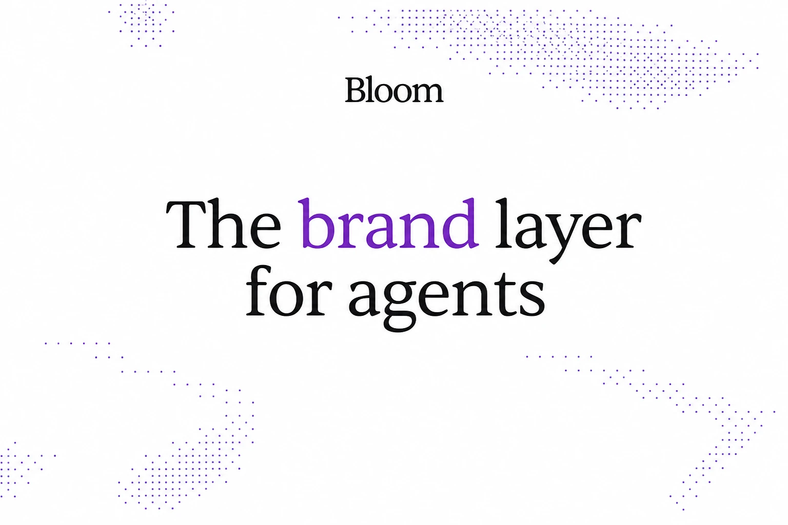

<div align="center">



<br />

# Bloom Templates

**Templates for connecting the Bloom brand layer to real product flows.**

[](https://trybloom.ai/mcp)
&nbsp;


</div>

---

Welcome to the Bloom templates repo.

Bloom is the brand layer: the place where a brand lives, and the system other tools can call when they need to create on the brand's behalf.

This repo has copy-ready templates for connecting Bloom to real product flows. Pick a template, add your keys, replace the demo event with your own, and ship branded output from the systems you already use.

## Templates

These templates are live now:

| Service | Template | Use it for | Status |
| --- | --- | --- | --- |
|  Resend | [`resend-dynamic-email`](./resend-dynamic-email) | Send dynamic emails with images generated from your Bloom brand. | Live |
|  n8n | [`n8n-content-repurposing`](./n8n-content-repurposing) | Repurpose one blog post into on-brand images for the blog and Instagram, LinkedIn, and X. | Live |

More coming soon at [`trybloom.ai/templates`](https://trybloom.ai/templates).

## How To Use A Template

Each folder works on its own. Copy the one you need into your workflow or system, install its dependencies, add the required keys, and connect it to the place where it should call Bloom.

You can copy a template with `degit`:

```bash
npx degit trybloomai/bloom-examples/<template-name> <your-folder-name>
```

`degit` copies only that folder from GitHub. You get the template files without the rest of the repo.

## What You Can Find Here

- Setup steps for each template
- Required Bloom and service keys
- Demo events you can replace with your own workflow events
- Prompt and integration code you can edit
- Notes for testing and shipping

## Point Your Agent At This

You can also ask a coding agent to wire a template into your workflow:

```text
Integrate one of the templates from trybloomai/bloom-examples into my workflow.
Replace the demo event with my real workflow event.
Keep my existing email, queue, or webhook setup where possible.
```

Works with Claude Code, Codex, Cursor, Windsurf, or any coding agent with repo access.
